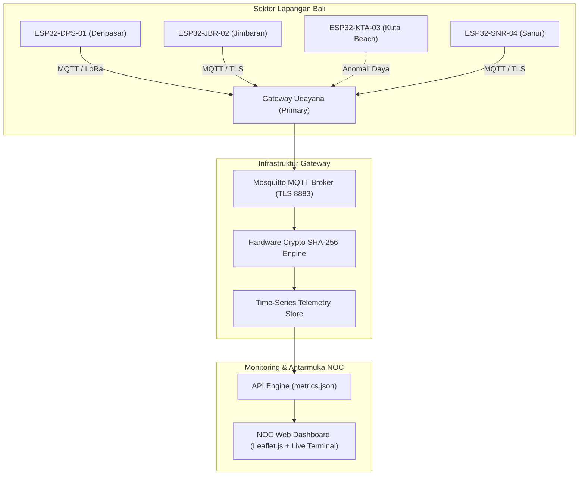

# Sistem Pemantauan Terpusat Node IoT Grid Regional Bali

> **Proyek Riset Terapan & Implementasi Lapangan**  
> Kolaborasi: **PT PLN (Persero) Unit Induk Distribusi Bali** × **Laboratorium Komputasi & IoT, Jurusan Teknik Elektro, Universitas Sriwijaya**  
> *Dosen Pembimbing / Peneliti Utama:* Prof. Ir. Abu Bakar, M.T., Ph.D.  
> *Peneliti & Pengembang Sistem:* Luthfi & Tim Lab IoT

---

## 📌 Deskripsi Sistem

Sistem ini merupakan arsitektur pemantauan telemetri terdistribusi berbasis **Internet of Things (IoT)** yang dirancang untuk memonitor stabilitas gardu distribusi 20kV, tegangan fasa (RMS), frekuensi grid listrik (50 Hz), serta integritas fisik trafo di kawasan strategis Regional Bali (Denpasar, Kuta, Jimbaran, Sanur).

Data dikumpulkan dari node sensor **ESP32 Industrial Microcontroller** yang terpasang pada tiang distribusi gardu PLN, dikirimkan secara berkala menggunakan protokol **MQTT over TLS 1.3** ke Gateway Pemantauan Terpusat.

---

## 🏗️ Arsitektur Teknologi

---

## 🚀 Fitur Utama Portofolio

1. **The Gatekeeper Authentication (`index.html`)**:
   - Portal autentikasi berstandar enterprise dengan validasi NIP resmi kedinasan dan enkripsi kredensial.
2. **NOC Real-Time Dashboard (`main.html`)**:
   - Pemantauan frekuensi grid (50.02 Hz), fluktuasi tegangan RMS (220.4 V), beban CPU gateway, dan throughput pesan MQTT.
   - Penarikan telemetri secara *asynchronous* via endpoint JSON (`/api-simulation/metrics.json`).
3. **Terminal Log "Hacker" (Live Server Telemetry)**:
   - Stream log Linux/daemon waktu nyata dengan pewarnaan level log (INFO, OK, WARN, CRITICAL).
4. **Peta Interaktif Geospasial Bali (`dashboard/nodes-map.html`)**:
   - Peta interaktif berbasis Leaflet.js dengan basemap CartoDB DarkMatter.
   - Marker node dengan status visual: Hijau stabil dan **Kedap-Kedip Merah (Alert)** pada node Kuta Beach yang sedang mengalami pemadaman trafo lokal.
5. **Manajemen Tiket Insiden & Audit Trail (`dashboard/incidents.html` & `dashboard/server-logs.html`)**:
   - Pelacakan gangguan otomatis dan riwayat journalctl systemd.

---

## 🌐 Deploy di GitHub Pages

Repositori ini siap dihosting secara gratis dan instan di **GitHub Pages**:
1. Push repository ini ke GitHub (`main` branch).
2. Buka menu **Settings** > **Pages** di repository GitHub Anda.
3. Di bagian **Build and deployment**, pilih **GitHub Actions** atau **Deploy from a branch (`main` / `/root`)**.
4. Website akan langsung aktif di `https://<username>.github.io/<repo-name>/`.
5. *(Opsional)* Hubungkan custom domain Anda melalui menu **Custom domain** (misal: `iot.domainlu.com`).
